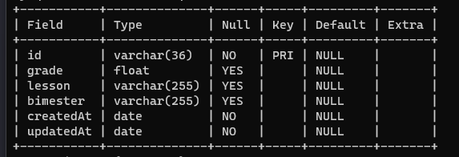

# Desafio - React, Node.js e Typescript

Uma API conectada a banco de dados e um front-end desenvolvido:

- React.js
- Tailwind
- ✨Typescript✨
- Node.js

## Features

- Criar (post) nova nota para bimestre.
- Deletar (delete) nota dada.
- Listagem de informações (get).

## Run

Para rodar em seu computador siga os passos:

Instale as dependências em ambas as pastas: backend e client com `npm install`

No backend rode `npm run build`

Rode ambas aplicações com o comando `npm start`

Para o arquivo `.env` confira os valores de usuário e senha do banco.

APP - [http://localhost:3000](http://localhost:3000) to view it in the browser.
API - [http://localhost:8080/api/v1/](http://localhost:8080/api/v1/) to view it in the browser.

## Banco e documentação Postman

Aqui você pode ver a `table` principal do projeto.

[Clique aqui para acessar a documentação no Postman](https://app.getpostman.com/join-team?invite_code=4919aa816d0c88cfe39da8f38132df94&target_code=3207fdea5e2f0d067a0f2f272429f9e8) - Você irá se deparar com algo assim:

## Resultados

[Clique aqui para visualizar um vídeo do app](https://www.loom.com/share/79b183ea7c094d69a3c57bd874fced87?sid=ce26600a-74ae-4378-8133-207e268dbe9a)

